# 1. Configuring the VESC

> ⚠️ **Important Safety Tips**
>
> - Put your car on an elevated stand so that its wheels can turn without it going anywhere. If you don’t have an RC car stand, you can use a box
> - Make sure you hold on to the car while testing the motor to prevent it from flying off the stand.
> - Make sure there are no objects (or people) in the vicinity of the wheels while testing.
> - Use a fully-charged LiPO battery instead of a power supply to ensure the motor has enough current to spin up.

## Equipment Required

- Fully built vehicle  
- Box or [Car stand](https://a.co/d/03Yckzs3) to put vehicle on  
- Laptop/computer (does not need to be running Linux)

---

## 1. Installing the VESC Tool

We need to configure the VESC so that it works with our motor and vehicle transmission.

Before you start, install the [VESC Tool](https://vesc-project.com/vesc_tool).  
You’ll need to register for an account to download it. Add the free tier tool to your cart. After checkout, a download link will be sent to your email.

Versions are available for Linux, Windows, and macOS.

> ℹ️ **Note**
>
> If using the VESC mkIV (e.g., hardware based on VESC 4.12) and the steps below do not work, see [this repository](https://github.com/f1tenth/vesc_firmware) for more details on building firmware and prebuilt versions for different hardware.

---

## 2. Powering the VESC

First, power the VESC:

- Plug in the battery and ensure correct polarity.
- You do **not** need to turn on the Powerboard for configuration.

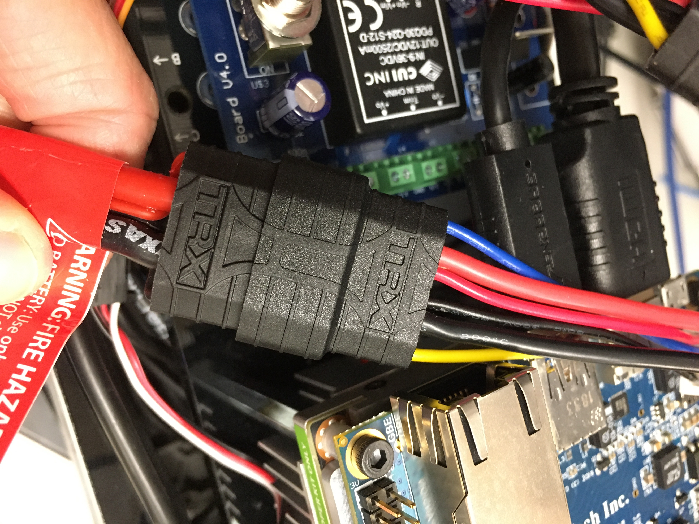

Next:

- Connect the VESC to your computer running VESC Tool using the usb cable (a longer cable may help)

---

## 3. Connecting the VESC to Your Laptop

- Launch **VESC Tool**
- On the Welcome page, click **AutoConnect** (bottom-left)
- Connection status appears in the bottom-right

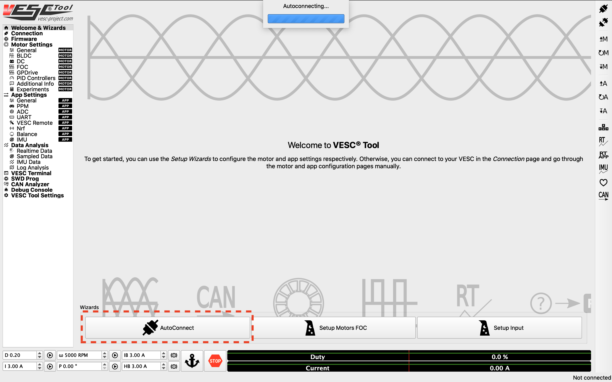

---

## 4. Updating the Firmware on the VESC

Update the firmware on the VESC.

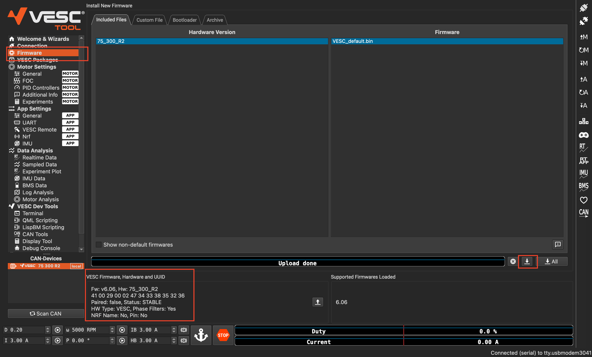

- Use default firmware
- Enable servo output:
  - **App Settings → General → Enable Servo Output** (set to `True`)

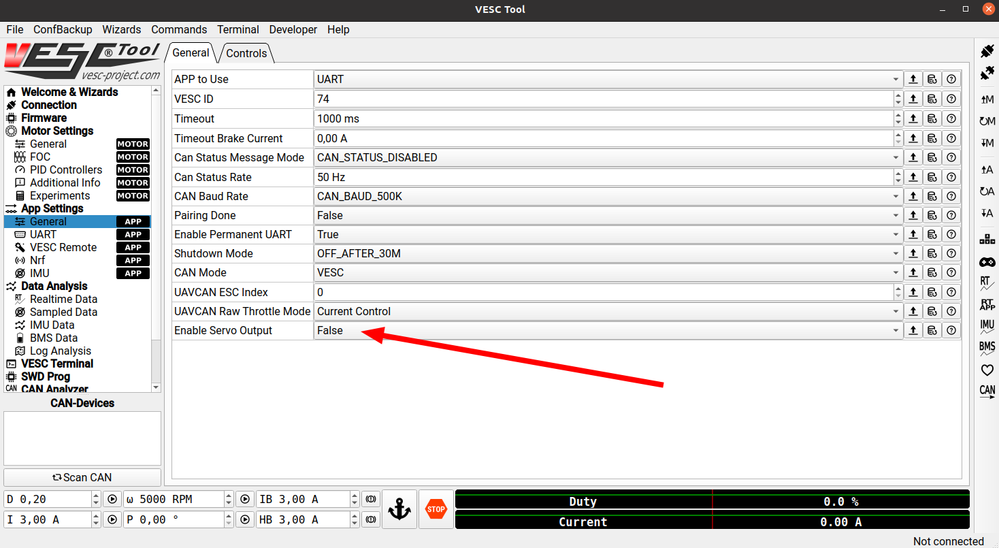

- Click **Write App Configuration** (down arrow + A) (need to click it whenever you make change in that section

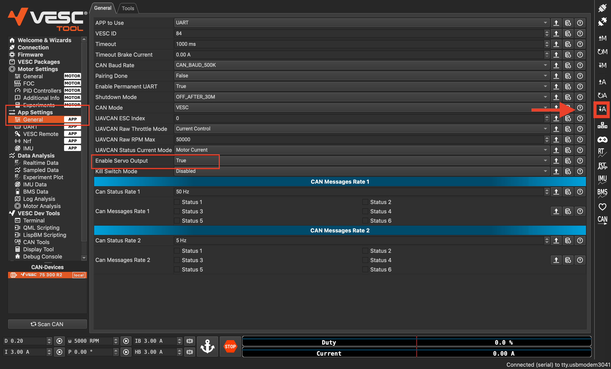

- Now go on `Tools`. Should be able to adjust the slider and see the front wheels turn as you are adjusting it. Make sure to center it after you are done testing it

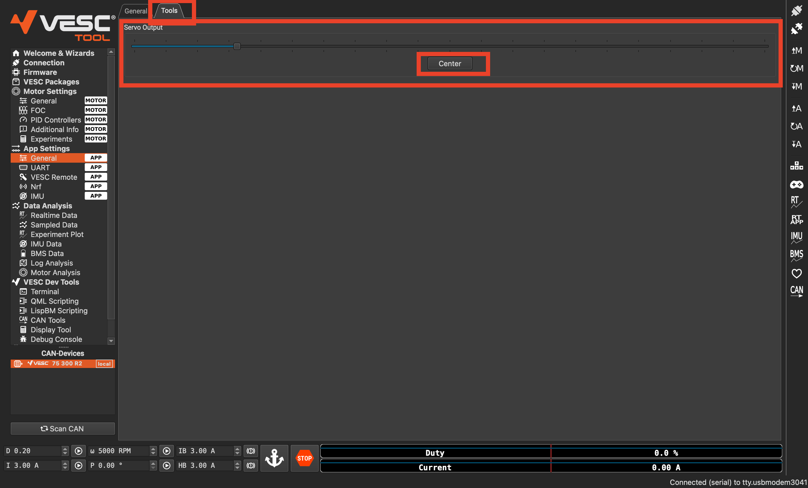

---

## 5. Setting Up the Motor Configuration

- Click on **Motor Setting** (on the side)
- Click on Motor Setup Wizard

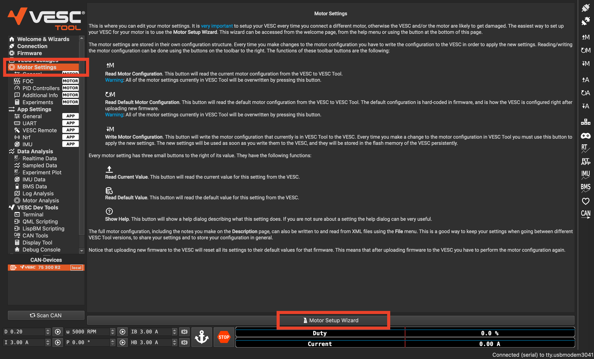

- Click on `No` if it ask to reset VESC to default settings or load default parameters
- Select `Generic` in the `Usage` section, then click on `Next`

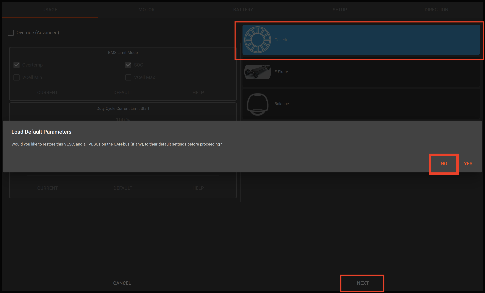

- Select Motor type and size. For our case it is `Small Inrunner (~200g)`
- Click on `Next`

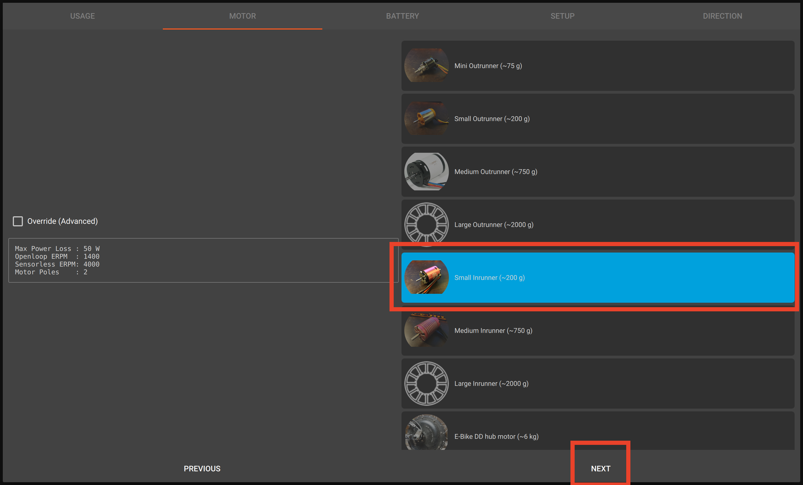

- Select your battery type, cells, and capacity
- Click on `Next`

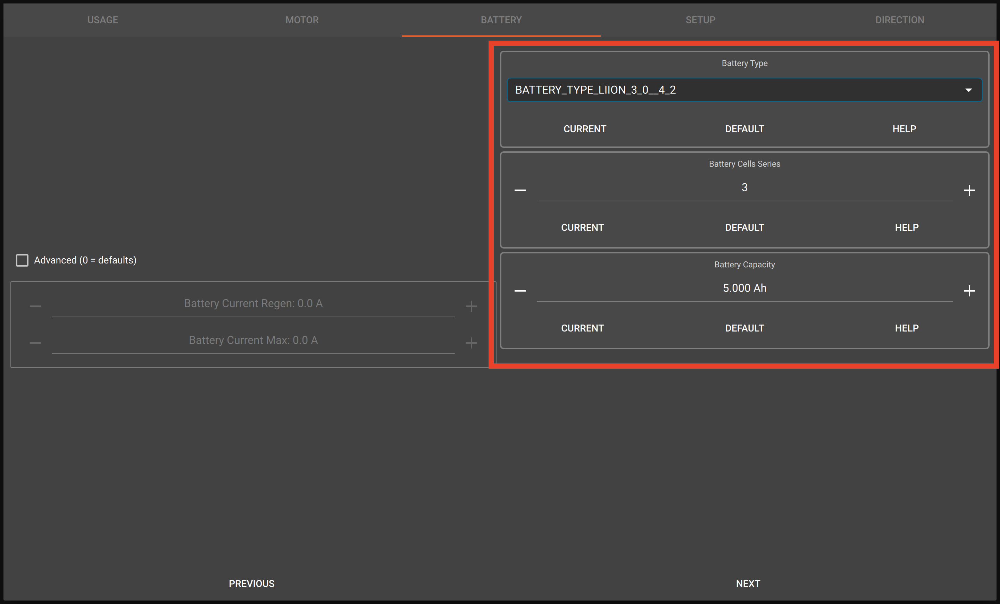

- Update your wheel size accordingly
- Do not change anything else on that page, unless you know what you are doing
- Click on `Run Detection`
> **Make sure to hold on to the vehicle and that nothing is in the way and that the wheels can spin freely without moving the vehicle**

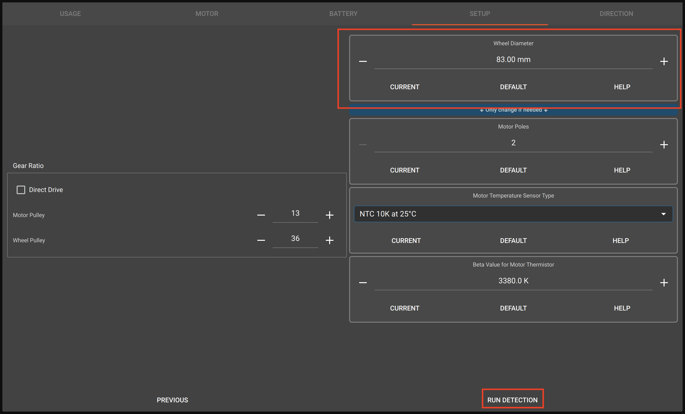

- Once the detection results show, click `Ok`
- Check that `FWD` and `REV` correspond to making the wheel spin to go forward and backward respectively
- If it runs in reverse, you can toggle to `Inverted` option or switch the exterior wire of the motor that are connected to the vesc
- Click on `Finish`

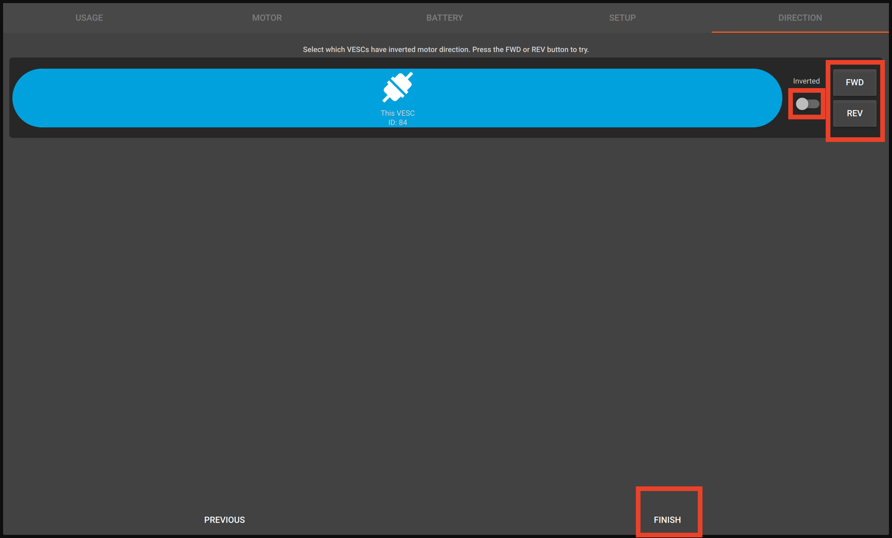

- Click on **Write Motor Configuration** (down arrow + M)

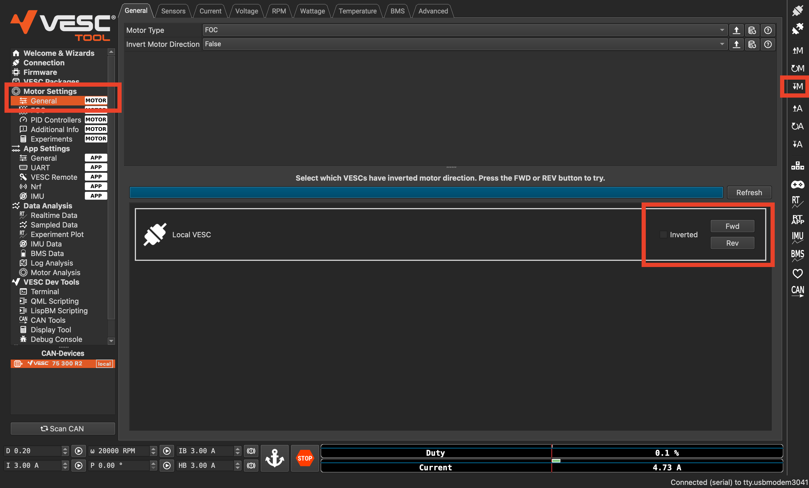

> ⚠️ You must click this button whenever you change motor configuration.

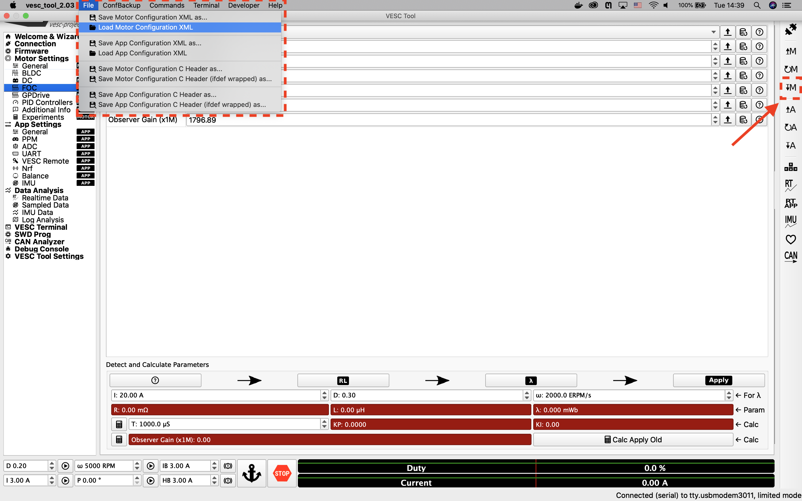

---

## 6. Detecting and Calculating Motor Parameters

- Go to **Motor Settings → FOC**
- Follow the 4-step detection process
- Motor will spin and make noise — ensure wheels are clear

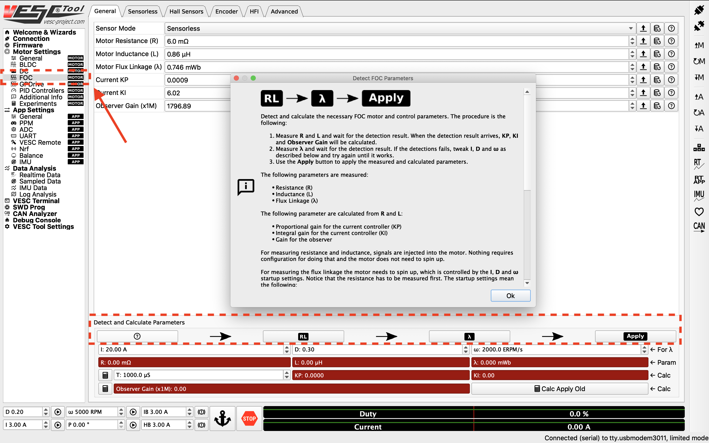

After detection:
- Fields turn green
- Click **Apply**
- Click **Write Motor Configuration**

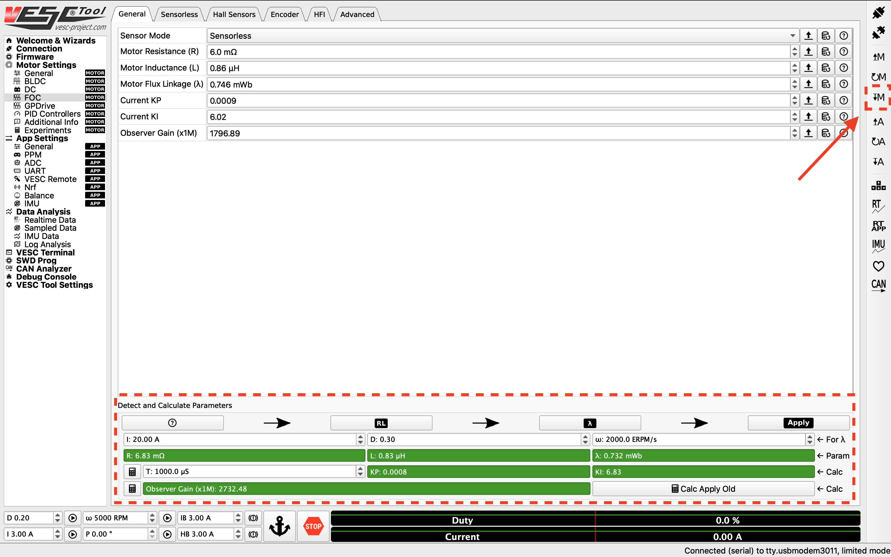

---

## 7. Changing Openloop Hysteresis and Time

- Go to **Sensorless** tab
- Set:
  - **Openloop Hysteresis = 0.01**
  - **Openloop Time = 0.01**
- Click **Write Motor Configuration**

---

## 8. Tuning the PID Controller

To monitor RPM:

- Go to **Data Analysis → Realtime Data**
- Click **Stream Realtime Data (RT button)**
- Open **RPM tab**

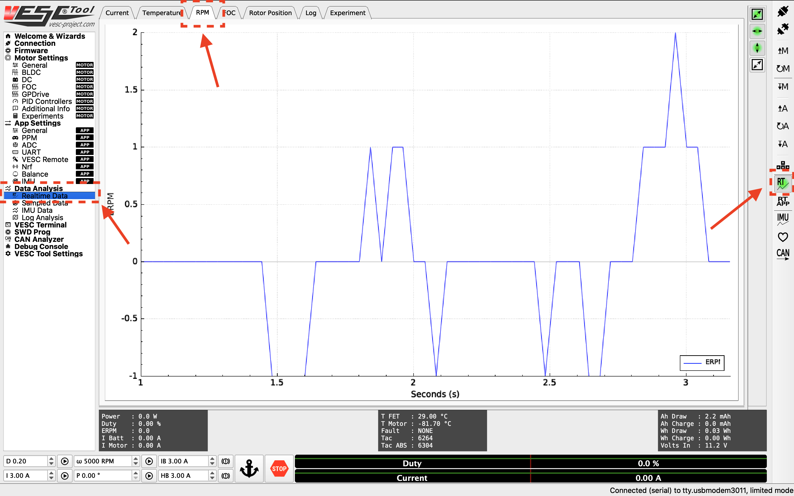

### Step Response Testing

- Set target RPM (2000–10000)
- Click **Play** to start motor
- Click **Stop/Anchor** to stop

### Goal

- Fast rise time
- Minimal steady-state error
- No oscillation

### Adjust PID Gains

- Go to **Motor Settings → PID Controllers**
- Tune Speed PID gains

> Tip: If oscillations occur, adjust **Speed PID Kd Filter**

---

## 9. Changing the Hardware Speed Limit

- Go to **Motor Settings → General**
- Adjust **Max ERPM** (forward/backward)

> ⚠️ **Important**
>
> See the *Odometry Tuning* section in your software stack setup to understand how velocity maps to ERPM and determine safe limits.

---
---
---

# *OLD INSTRUCTIONS (MIGHT NEED TO LOOK AT THIS IF ABOVE DOES NOT WORK)*

# 1. Configuring the VESC

> ⚠️ **Important Safety Tips**
>
> - Put your car on an elevated stand so that its wheels can turn without it going anywhere. If you don’t have an RC car stand, you can use a box
> - Make sure you hold on to the car while testing the motor to prevent it from flying off the stand.
> - Make sure there are no objects (or people) in the vicinity of the wheels while testing.
> - Use a fully-charged LiPO battery instead of a power supply to ensure the motor has enough current to spin up.

## Equipment Required

- Fully built vehicle  
- Box or [Car stand](https://a.co/d/03Yckzs3) to put vehicle on  
- Laptop/computer (does not need to be running Linux)

> ℹ️ **Note**
>
> If using the VESC mkIV (e.g., hardware based on VESC 4.12), see [this repository](https://github.com/f1tenth/vesc_firmware) for more details on building firmware and prebuilt versions for different hardware.

---

## 1. Installing the VESC Tool

We need to configure the VESC so that it works with our motor and vehicle transmission.

Before you start, install the [VESC Tool](https://vesc-project.com/vesc_tool).  
You’ll need to register for an account to download it. Add the free tier tool to your cart (only email required). After checkout, a download link will be sent to your email.

Versions are available for Linux, Windows, and macOS.

---

## 2. Powering the VESC

First, power the VESC:

- Plug in the battery and ensure correct polarity.
- You do **not** need to turn on the Powerboard for configuration.

Next:

- Unplug the USB cable from the Jetson NX
- Plug it into your laptop running VESC Tool (a longer cable may help)

---

## 3. Connecting the VESC to Your Laptop

- Launch **VESC Tool**
- On the Welcome page, click **AutoConnect** (bottom-left)
- Connection status appears in the bottom-right

---

## 4. Updating the Firmware on the VESC

Update the firmware on the VESC.

### For VESC Tool versions after Mar. 31, 2021:
- Use default firmware
- Enable servo output:
  - **App Settings → General → Enable Servo Output**

### For versions before 2.05:
- Go to **Firmware** tab
- Check **Show non-default firmwares**
- Select `VESC_servoout.bin`
- Click the **download arrow button** to upload firmware

---

## 5. Uploading the Motor Configuration XML

- Select **Load Motor Configuration XML**
- Choose the XML file from [here](https://drive.google.com/file/d/1-KiAh3hCROPZAPeOJtXWvfxKY35lhhTO/view?usp=sharing)
- Click **Write Motor Configuration** (down arrow + M)

> ⚠️ You must click this button whenever you change motor configuration.

---

## 6. Detecting and Calculating Motor Parameters

- Go to **Motor Settings → FOC**
- Follow the 4-step detection process
- Motor will spin and make noise — ensure wheels are clear

After detection:
- Fields turn green
- Click **Apply**
- Click **Write Motor Configuration**

---

## 7. Changing Openloop Hysteresis and Time

- Go to **Sensorless** tab
- Set:
  - **Openloop Hysteresis = 0.01**
  - **Openloop Time = 0.01**
- Click **Write Motor Configuration**

---

## 8. Tuning the PID Controller

To monitor RPM:

- Go to **Data Analysis → Realtime Data**
- Click **Stream Realtime Data (RT button)**
- Open **RPM tab**

### Step Response Testing

- Set target RPM (2000–10000)
- Click **Play** to start motor
- Click **Stop/Anchor** to stop

### Goal

- Fast rise time
- Minimal steady-state error
- No oscillation

### Adjust PID Gains

- Go to **Motor Settings → PID Controllers**
- Tune Speed PID gains

> Tip: If oscillations occur, adjust **Speed PID Kd Filter**

---

## 9. Changing the Hardware Speed Limit

- Go to **Motor Settings → General**
- Adjust **Max ERPM** (forward/backward)

> ⚠️ **Important**
>
> See the *Odometry Tuning* section in your software stack setup to understand how velocity maps to ERPM and determine safe limits.
